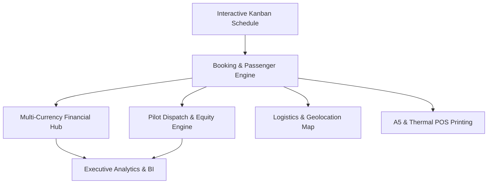

# 🪂 Paragliding Flight Operations & Enterprise Reservation System
**A Full-Stack Case Study, Social Media Post & Complete Technical Architecture Breakdown**

---

## 📢 Part 1: Social Media & LinkedIn Announcement Post

> **Headline:** *From Operational Chaos in Babadağ to a Production Enterprise Solution: How I Built & Deployed a Complete Paragliding ERP System in Fethiye, Turkey.*

When engineering real-world software, nothing beats solving a high-stakes problem you have lived through and experienced firsthand with your own eyes and hands.

During my Master’s studies in **Information Systems Management (MSI)**, I spent two months working on the ground with a commercial tandem paragliding company in **Babadağ, Fethiye**—one of the world's premier flight destinations. My role involved managing daily flight schedules, passenger bookings, pilot dispatches, and multi-currency cashier desks.

### 🔴 The Problem: Ground-Level Operational Chaos
Despite welcoming hundreds of international tourists daily and charging premium ticket prices, operations were running on fragile, disconnected manual workflows:
- ❌ **Primitive Tooling:** Relying on generic note-taking apps and fragile digital spreadsheets.
- ❌ **Financial Blindspots:** No clear visibility into whether a booking was paid in full, had a partial deposit, or owed an outstanding balance. No proper tracking of multiple currencies (**USD, EUR, GBP, TRY**) or payment channels (**Cash, POS Card, Bank Wire**).
- ❌ **Zero Accountability:** When an error or double-booking occurred, there was no audit log to identify who made the change, when, or why.
- ❌ **Pilot Workload Imbalances:** Lack of fair flight distribution mechanisms, causing disputes over queue fairness and flying quotas.
- ❌ **Complete Absence of Business Intelligence:** Zero data on customer origin nationalities, peak thermal wind demand hours, top-converting travel agencies, or most profitable flight add-ons.

---

### 🟢 The Solution: An End-to-End Enterprise Web Platform
Leveraging my academic background in Information Systems and full-stack software engineering, I architected and built an end-to-end **Paragliding Operations & ERP Web Application** from the ground up to solve all these pain points:

- 🔹 **Backend:** **.NET 9 Web API (C#)** — Clean Architecture, Entity Framework Core, JWT Bearer Security, LINQ, and Repository Pattern.
- 🔹 **Frontend:** **Angular 19 (TypeScript)** — Standalone Architecture, Vanilla CSS Design System, Leaflet Maps, and Angular CDK Drag & Drop Kanban.
- 🔹 **Database:** **MySQL / MariaDB 10.11** — Relational schema with referential integrity, indexes, and automated seed migrations.
- 🔹 **DevOps & Cloud:** **Docker & Docker Compose** with Nginx Reverse Proxy for containerized, zero-downtime deployment.

---

### 🏆 Commercial Validation & Production Deployment
The system was successfully deployed into active production and **purchased by the commercial company**, where it now manages daily flight logistics, pilot dispatches, and financial reconciliation in real time with continuous updates.

---

### 🔗 Explore the Project:
- 🌐 **Live Demo Application:** [http://2.24.115.165](http://2.24.115.165)
- 💻 **GitHub Source Code:** [github.com/anass2002-dr/ReservationSystem](https://github.com/anass2002-dr/ReservationSystem)

---

## 🏗️ Part 2: Complete Module-by-Module Technical Breakdown

### 1. 🗂️ Interactive Flight Schedule & Kanban Dispatch Dashboard
- **Route:** `/reservations` *(Schedule View)*
- **Core Purpose:** The central flight operations control room for dispatchers and ground managers.
- **Key Capabilities:**
  - **Time-Slot Kanban Columns:** Automatically clusters bookings into scheduled daily takeoff slots (e.g., `08:30`, `10:30`, `13:00`, `15:00`, `17:00`).
  - **Fluid Drag-and-Drop:** Powered by `@angular/cdk/drag-drop`, allowing managers to dynamically reassign bookings between time slots as weather windows evolve.
  - **Live Visual Status Indicators:** Real-time badges for `PAID IN FULL`, `XX.XX DUE`, `REFUND`, `PAX Count`, and agency attribution.
  - **Instant Manifest PDF Generation:** Generates official takeoff manifests formatted for mountain marshals, tower controllers, and transport drivers.
  - **100% Responsive Adaptive Interface:** Optimized for desktop dual monitors, iPad tablets on takeoff hills, and mobile smartphones.

---

### 2. 📝 High-Velocity Reservation & Passenger Management
- **Route:** `/reservations/add` | `/reservations/edit/:id`
- **Core Purpose:** Fast passenger onboarding, service customization, and data entry completed in under 60 seconds.
- **Key Capabilities:**
  - **Multi-PAX Group Booking:** Add single or multiple passengers under one booking reservation with personalized package configurations.
  - **Intelligent Customer CRM Lookup:** Instant typeahead auto-lookup for returning customers, pre-filling contact info, date of birth, and nationality.
  - **Pilot & Group Assignment:** Filter pilots by team groups (Team Alpha, Team Bravo, Freelance) with live flight counters.
  - **Dynamic Packages & Extras:** Select flight tiers (*Standard Flight, Sunset VIP, Acro Aerobatic*) and add-ons (*4K GoPro Video, 360° VR Cam, Merchandise*).
  - **Real-Time Financial Calculator:** Dynamic recalculation of total amounts, advance deposits, and remaining balances upon any input change.
  - **Mandatory Weight Limit Compliance:** Interactive safety switch verifying passenger weight compliance prior to booking confirmation.

---

### 3. 💳 Real-Time Multi-Currency Financial & Payment Engine
- **Route:** `/payments` | Top Navigation Header Widget
- **Core Purpose:** Eliminates currency confusion, accounting discrepancies, and cashier balance errors.
- **Key Capabilities:**
  - **4 Supported Currencies:** Complete native support for Turkish Lira (**TRY**), US Dollar (**USD**), Euro (**EUR**), and British Pound (**GBP**).
  - **Live Cross-Currency Converter:** Instant header calculation tool for frontline cashiers converting prices between currencies in real time.
  - **Multi-Channel Payment Ledger:** Records exact breakdown per transaction (*Cash, POS Card, Bank Transfer, Online Advance*).
  - **Deposit & Due Tracking:** Tracks advance deposits collected during booking and highlights remaining balances due on takeoff day.
  - **Refund Security & Auditing:** Transparent logging of bad-weather cancellation refunds to prevent unauthorized revenue leakage.

---

### 4. 👨‍✈️ Pilot Roster, Allocation & Workload Equity Engine
- **Route:** `/pilots`
- **Core Purpose:** Guarantees transparent, fair, and dispute-free flight assignments among commercial tandem pilots.
- **Key Capabilities:**
  - **Workload Balance Tracker:** Live counters tracking `Flights Assigned` vs. `Flights Flown` to guarantee fair income distribution.
  - **Pilot Grouping & Shifts:** Categorizes pilots by specialized shifts, licenses, and aircraft wings.
  - **Performance Metrics:** Monitors daily flight quotas, passenger ratings, and active duty statuses.
  - **Mobile Pilot Access:** Pilots can view their assigned passengers, weight constraints, and media package requests on mobile devices before mountain ascent.

---

### 5. 🏢 Customer CRM & Travel Agency (B2B) Network
- **Route:** `/customers` | `/agencies`
- **Core Purpose:** Nurtures repeat customer loyalty and automates B2B partner relationship management.
- **Key Capabilities:**
  - **Centralized Customer Database:** Full flight histories, passport files, nationality demographics, and emergency contact details.
  - **B2B Travel Agency Portal:** Tracks bookings referred by external tour operators, online travel agencies (OTAs), and local hotel desks.
  - **Billet / Voucher Verification:** Reconciles external agency paper voucher numbers with internal system tickets to prevent counterfeit vouchers.
  - **Custom Pricing & Commissions:** Applies agency-specific discounted rates and commission structures.

---

### 6. 📊 Executive Business Intelligence & Analytics Dashboard
- **Route:** `/analytics` | List View Financial Panel
- **Core Purpose:** Empowers company executives with strategic data for pricing, marketing, and staffing decisions.
- **Key Capabilities:**
  - **Multi-Currency Revenue Ledger:** Detailed breakdown of Gross Revenue, Total Collected, and Unpaid Receivables per currency (**TRY/USD/EUR/GBP**).
  - **Tourist Nationality Heatmap:** Visual ranking of top visitor nationalities (UK, Germany, China, Russia, Gulf States) to guide targeted ad spending.
  - **Acquisition Channel Performance:** Compares ROI across Direct Walk-ins, Website Inquiries, Partner Agencies, and Hotel Concierges.
  - **Slot Demand Distribution:** Identifies peak flight hours (e.g., thermal noon vs. calm morning) to adjust pilot shifts accordingly.
  - **One-Click Excel Export:** Instant `.xlsx` spreadsheet generation for accounting reconciliation and tax documentation.

---

### 7. 📍 Geolocation & Hotel Pickup Logistics Engine
- **Route:** Embedded in Booking Flow
- **Core Purpose:** Eliminates lost shuttle drivers and missed hotel pickup schedules.
- **Key Capabilities:**
  - **Interactive Leaflet / OpenStreetMap Integration:** Live map pinpoints exact pickup coordinates.
  - **Hotel Autocomplete Search:** Fast typeahead search for hotels across Fethiye, Ölüdeniz, and Hisarönü.
  - **Shuttle Vehicle & Driver Assignment:** Assigns passengers to specific shuttle vans for synchronized transfers from resort to mountain base.

---

### 8. 🖨️ Multi-Format Professional Document Generation
- **Core Purpose:** Instant paper trail generation for clients, takeoff tower officials, and accounting.
- **Key Capabilities:**
  - **A5 Professional Laser Voucher:** Beautiful branded voucher with flight details, terms & conditions, QR code, and pricing summary.
  - **80mm Thermal POS Receipt:** Rapid receipt printing on Sewoo/Epson POS printers for frontline desk passes.
  - **Digital Document Vault:** Secure upload and instant preview of passport photos, signed insurance waivers, and payment receipts.

---

### 9. 🔒 Enterprise Security & Audit Trail
- **Core Purpose:** Protects financial records and enforces accountability.
- **Key Capabilities:**
  - **Role-Based Access Control (RBAC):** Distinct permission sets for Administrators (full access, financial reports, settings) vs. Operators (booking & dispatch only).
  - **Granular Change Auditing:** Immutable `CreatedAt` and `UpdatedAt` timestamps and user IDs tracking every booking modification.
  - **Secure Token Authentication:** ASP.NET Core JWT Bearer tokens with encrypted password hashing and CORS isolation.

---

### 10. 🐳 Cloud DevOps & Docker Containerization
- **Core Purpose:** Guarantees fast, reproducible, zero-configuration deployment on any server.
- **Key Capabilities:**
  - **Multi-Container Architecture:**
    - `reservation_backend`: .NET 9 ASP.NET Core Web API container.
    - `reservation_frontend`: Production Angular 19 SPA served via Alpine Nginx.
    - `reservation_db`: MariaDB 10.11 with persistent named volumes for zero data loss.
    - `reservation_phpmyadmin`: GUI for database management.
  - **Single-Command Lifecycle:** Fully automated deployment via `docker-compose up -d --build`.

---

## 🛠️ Technology Stack Overview

| Layer | Technologies Used |
| :--- | :--- |
| **Backend API** | C#, .NET 9 Web API, Entity Framework Core, LINQ, JWT Authentication |
| **Frontend SPA** | Angular 19, TypeScript, Vanilla CSS3 (Tokens), Bootstrap Icons, Angular CDK, Leaflet.js, Flatpickr |
| **Database** | MySQL / MariaDB 10.11 |
| **DevOps & Proxy** | Docker, Docker Compose, Nginx (Alpine Linux) |
| **Output Formats** | PDF Flight Manifests, Excel (.xlsx), A5 Customer Vouchers, 80mm POS Thermal Slips |
| **Live Demo** | [http://2.24.115.165](http://2.24.115.165) |
| **Repository** | [github.com/anass2002-dr/ReservationSystem](https://github.com/anass2002-dr/ReservationSystem) |
